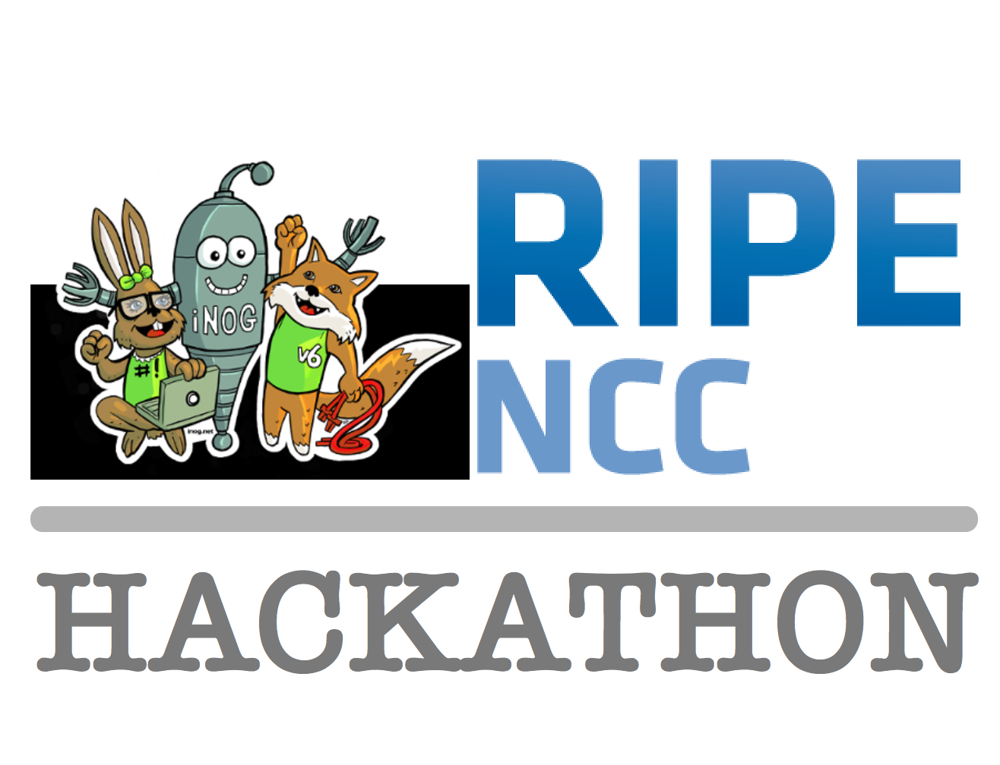

## Go-NETCONF Client

This is a go-netconf command line client created for use within workflows as a component. This component can be in a composable stack, it takes single '-' command line arguments. Please use `./netconfclient -h` for help.

This client can handle SSH transport (currently with user/pass credentials) and direct Junos transport. XML envelopes can be fed in through a command line argument or it can read the content of a file.

## Creation

This code was created as part of the RIPE iNOG Hackathon on Dublin, Ireland over the weekend of the 23rd and 24th of June 2018.

Thanks to RIPE, DoWork Dublin and the team from iNOG.



## Build

Two binaries are included at version 0.3 of the code.

```bash
├── gonetconfclient-linux-x64-0.3
└── gonetconfclient-osx-x64-0.3
```

The OSX binary was built using the below:

```bash
cd /netconfclient
go build
```

The Linux binary was built using the below:

```bash
cd /netconfclient
GOOS=linux go build
```
